# AgentMemory 技术架构图集

> 本文档包含项目答辩所需的各种技术架构图，使用 Mermaid 语法绘制

---

## 1. 系统整体架构图

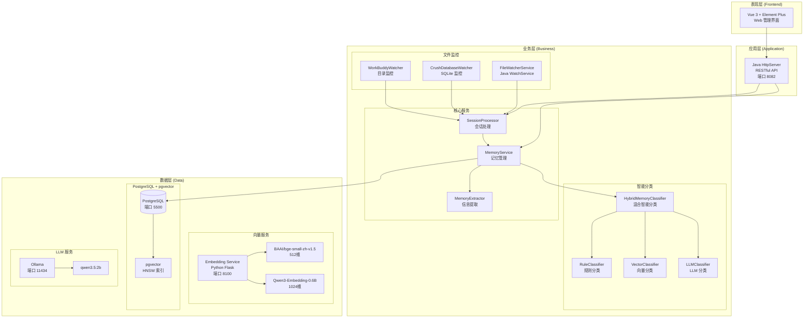

---

## 2. Agent 监控与数据流程图

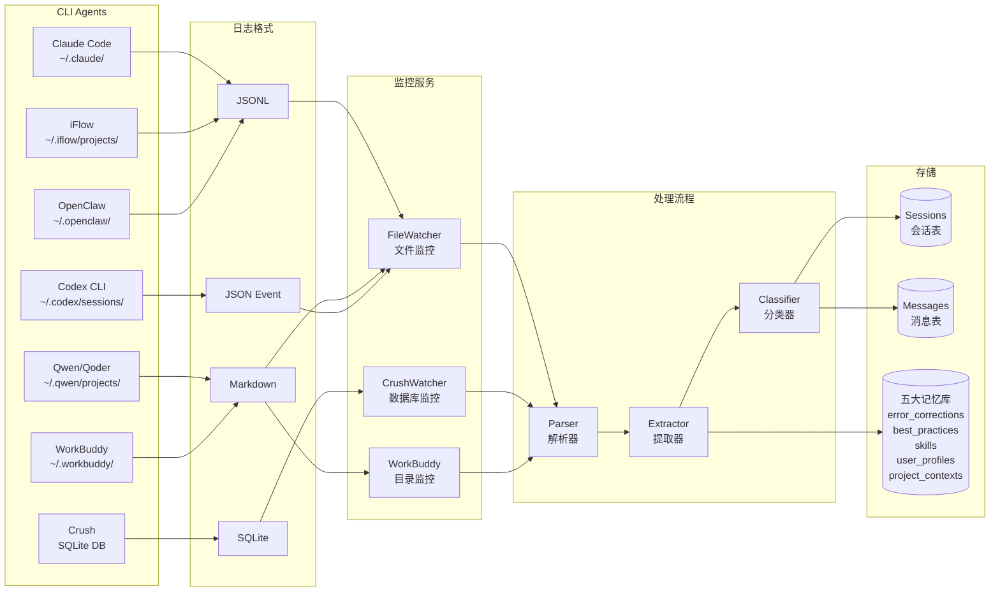

---

## 3. 混合智能分类系统架构图

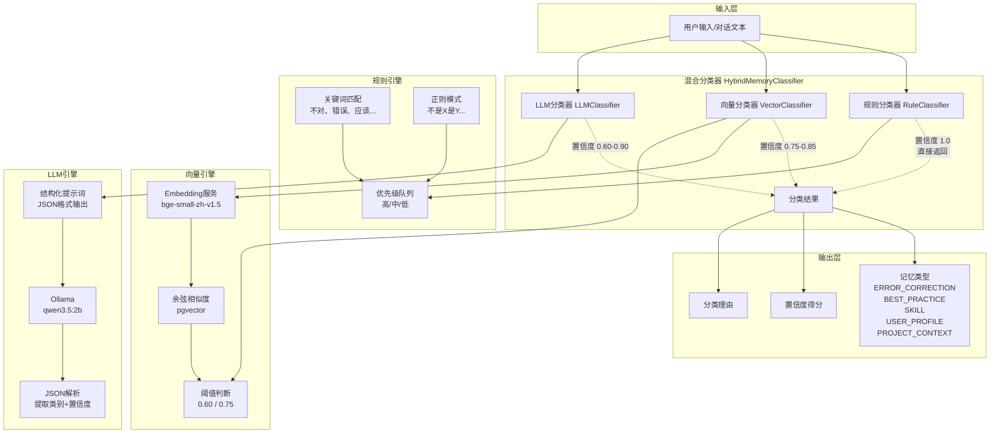

---

## 4. 混合分类调度流程图

```mermaid
flowchart TD
    A([开始]) --> B[输入文本]
    
    B --> C{"规则分类判断"}
    
    C -->|"命中关键词<br/>如'不对'、'错了'| D[直接返回<br/>规则分类结果<br/>置信度: 1.0]
    
    C -->|"未命中"| E{"向量相似度判断"}
    
    E -->|"相似度 ≥ 0.75"| F[采用向量分类<br/>置信度: 0.75-0.85]
    
    E -->|"相似度 < 0.60"| G{"LLM语义分类"}
    
    E -->|"0.60 ≤ 相似度 < 0.75"| H[向量+规则<br/>综合判断<br/>置信度: 0.60-0.75]
    
    G -->|"LLM置信度 ≥ 0.60"| I[采用LLM分类<br/>置信度: 0.60-0.90]
    
    G -->|"LLM置信度 < 0.60"| J[规则分类器兜底<br/>置信度: < 0.60]
    
    D --> K([分类完成])
    F --> K
    H --> K
    I --> K
    J --> K
    
    style D fill:#90EE90
    style F fill:#87CEEB
    style I fill:#DDA0DD
    style J fill:#F0E68C
```

---

## 5. 数据库 ER 图

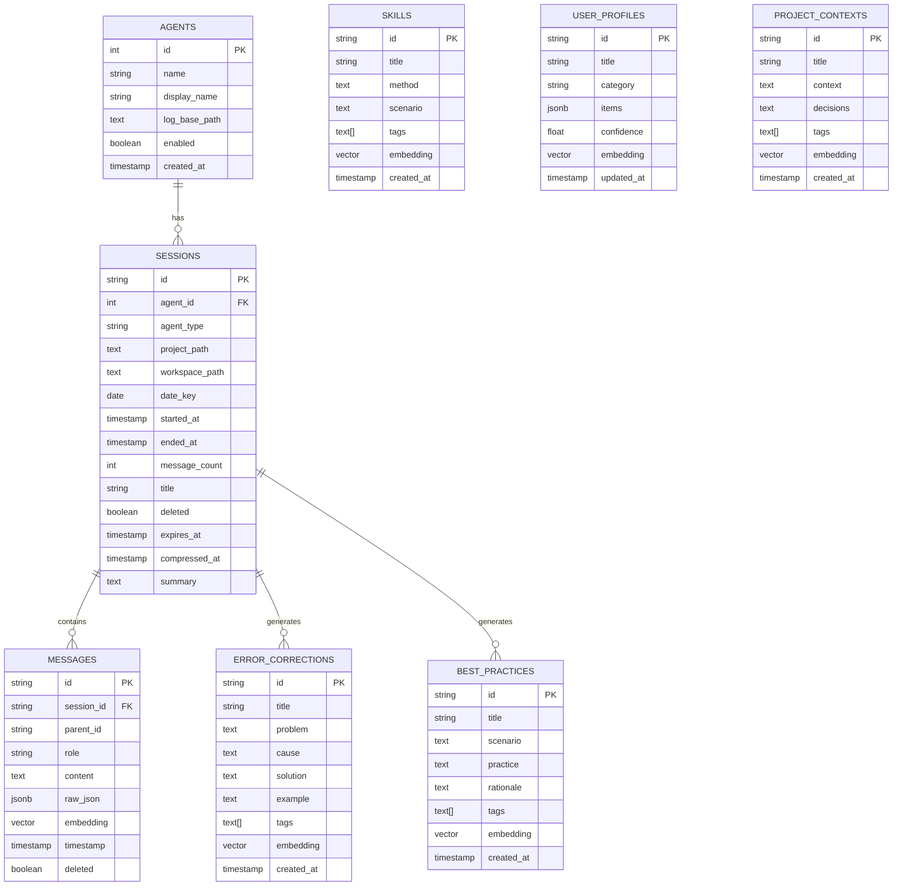

---

## 6. 会话处理时序图

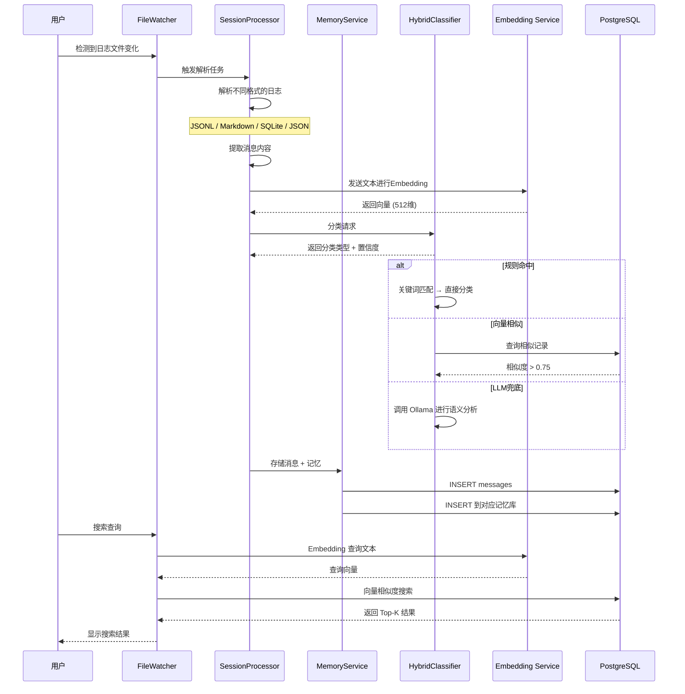

---

## 7. 多Agent数据采集架构

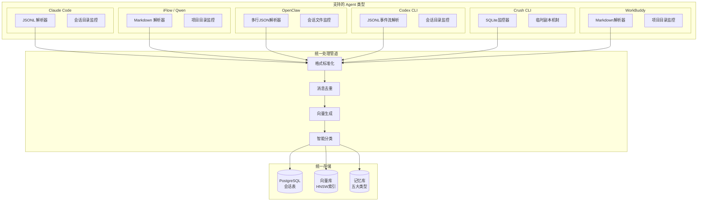

---

## 8. 语义检索流程图

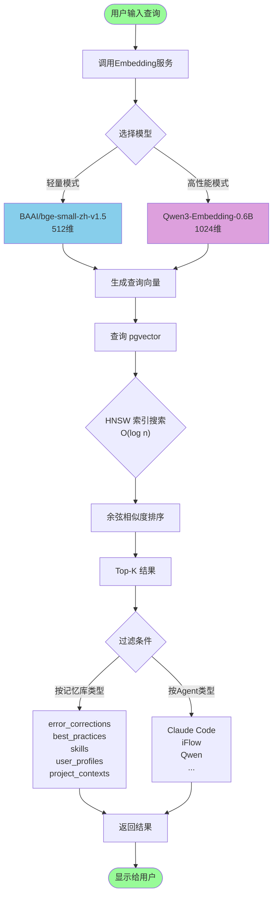

---

## 9. 系统部署架构图

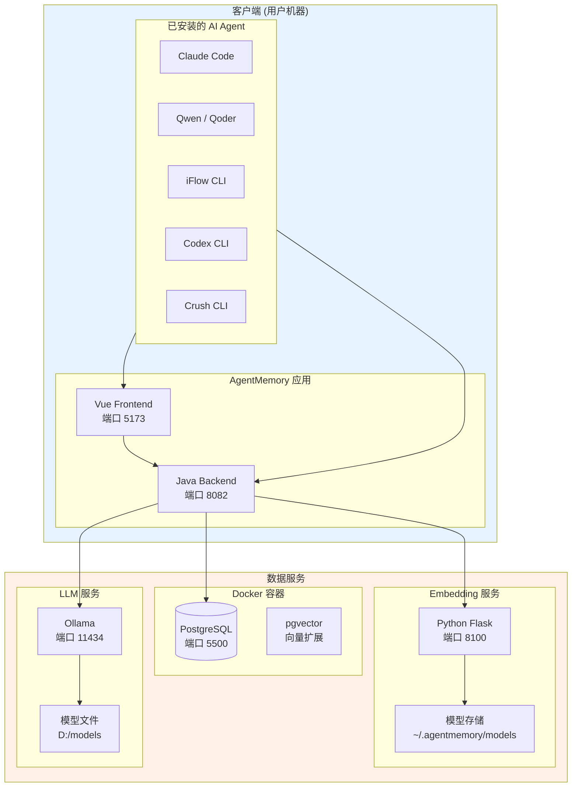

---

## 10. 记忆库分类体系图

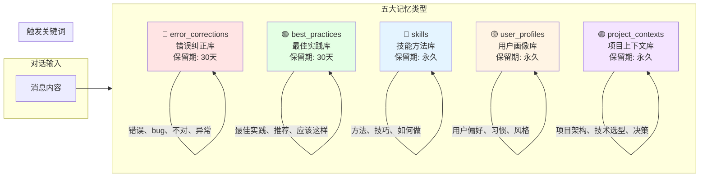

---

## 11. 性能优化架构图

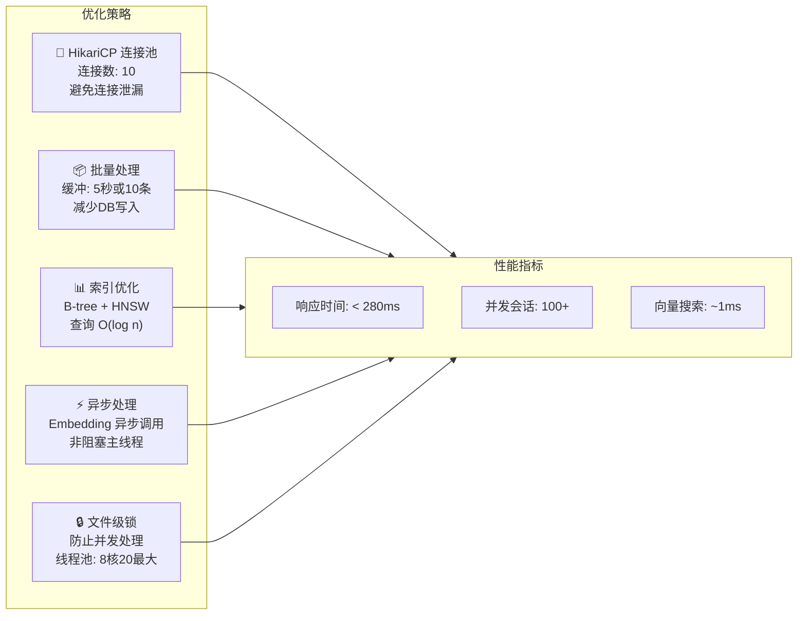

---

## 12. 系统启动流程图

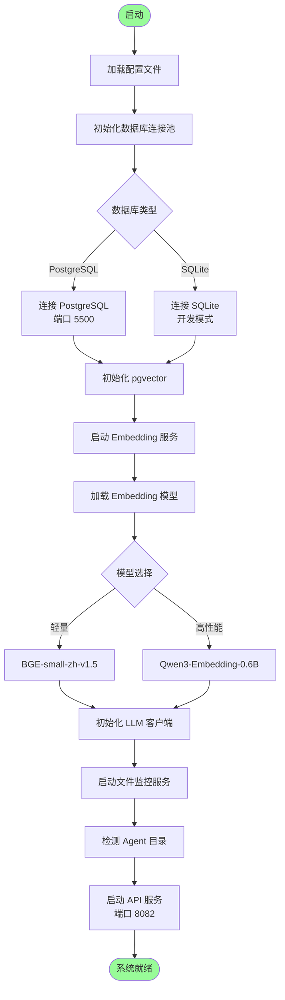

---

**注**：以上图表可在 Markdown 编辑器（如 Typora、Obsidian、VSCode）中直接渲染，也可以在论文中导出为图片。